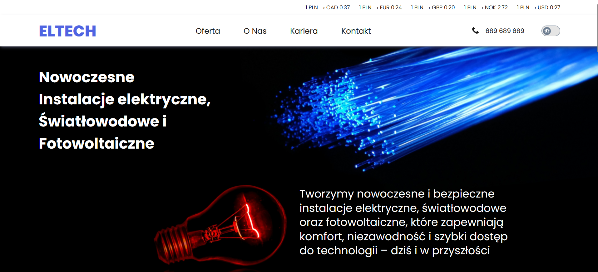
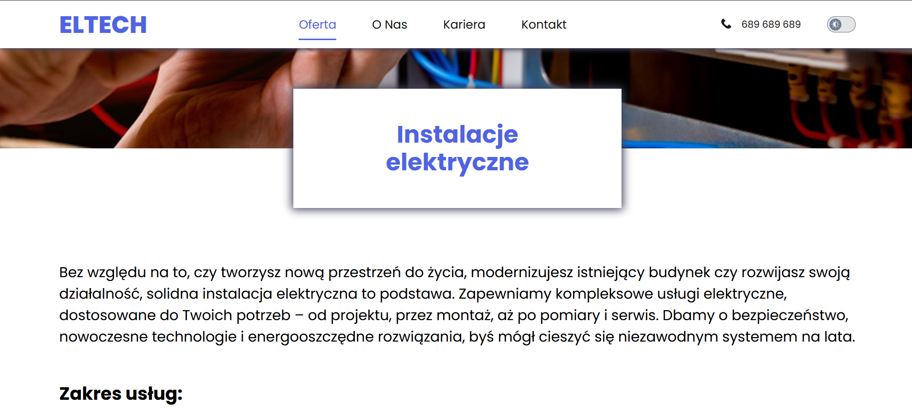
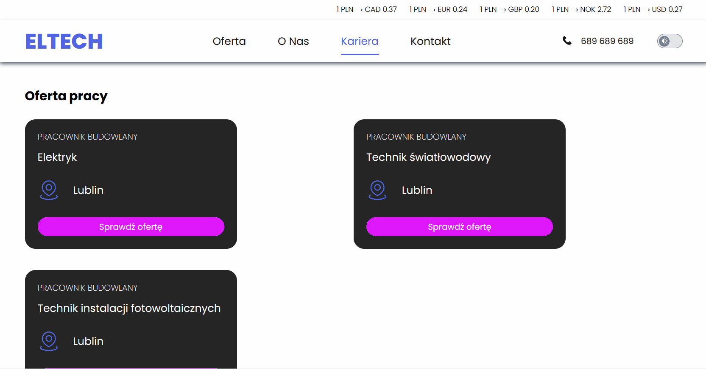

# ELTECH sp. z o. o. Web Page
The website is the showcase of an electrical company. The page contains information about the offered services, information about the company, job offers and contact details. 
 
Here is a working live demo: https://anna-wojcik.github.io/Eltech-app/.
This project was bootstrapped with [Create React App](https://github.com/facebook/create-react-app).

## Table of Contents
* [Site](#site)
    * [Home page](#home-page)
    * [Offer page](#offer-page)
    * [About us page](#about-us-page)
    * [Career page](#career-page)
    * [Contact page](#contact-page)
* [Technologies Used](#technologies-used)
* [Available Scripts](#available-scripts)
* [Acknowledgements](#acknowledgements)
* [Author](#author)

## Site
The website consists of a home page and four additional subpages: home page, offer page, about us page, career page and contact page.

### Home page
At the top of the page there is information about what the company does. The navigation includes a logo, links to other subpages, a telephone number and a button changing the theme.
Additionally, there are current exchange rates above the navigation. 

Next, there are buttons that refer to subpages, which contain detailed information. 

Below the buttons there is a section with customer reviews.

At the very bottom there is a footer that contains basic company information, as well as buttons for social networking sites.

### Offer page
This page contains detailed information about the services offered by the company.

### About us page
This page contains information about the company, its history and mission. Current time is placed at the top. 

### Career page
This page contains information about job offers and the possibility of applying for a job. 
After cliking on "Check the offer" button, the user is redirect to details of the job offer.

After clicking the "Apply" button, the user is redirected to a form where they can fill in their personal data. 
After completing the data and clicking the "Next" button, the user can make changes to the application form. After clicking the send button, the user will be notified when the form is sent and will then be able to go to the home page.

### Contact page
On this page, the user will find the company's contact information and a map with the location.

## Technologies Used
- JavaScript ES6
- Redux - Toolkit
- React Router
- Axios
- Styled Components
- Hooks (useState, useEffect, useHistory, useLocation)
- Custom Hooks
- HTML 5
- CSS 3
- Media Queries
- Normalize CSS
- BEM Convention
- Flex, Grid

## Available Scripts

In the project directory, you can run:

### `npm start`

Runs the app in the development mode.\
Open [http://localhost:3000](http://localhost:3000) to view it in your browser.

The page will reload when you make changes.\
You may also see any lint errors in the console.

### `npm run build`

Builds the app for production to the `build` folder.\
It correctly bundles React in production mode and optimizes the build for the best performance.

The build is minified and the filenames include the hashes.\
Your app is ready to be deployed!

See the section about [deployment](https://facebook.github.io/create-react-app/docs/deployment) for more information.

### `npm run eject`

**Note: this is a one-way operation. Once you `eject`, you can't go back!**

If you aren't satisfied with the build tool and configuration choices, you can `eject` at any time. This command will remove the single build dependency from your project.

Instead, it will copy all the configuration files and the transitive dependencies (webpack, Babel, ESLint, etc) right into your project so you have full control over them. All of the commands except `eject` will still work, but they will point to the copied scripts so you can tweak them. At this point you're on your own.

You don't have to ever use `eject`. The curated feature set is suitable for small and middle deployments, and you shouldn't feel obligated to use this feature. However we understand that this tool wouldn't be useful if you couldn't customize it when you are ready for it.

## Acknowledgements
This website was created thanks to the skills gained from the course "Frontend Developer from the basis" online programming school YouCode.

## Author
Created by Anna Wójcik.
